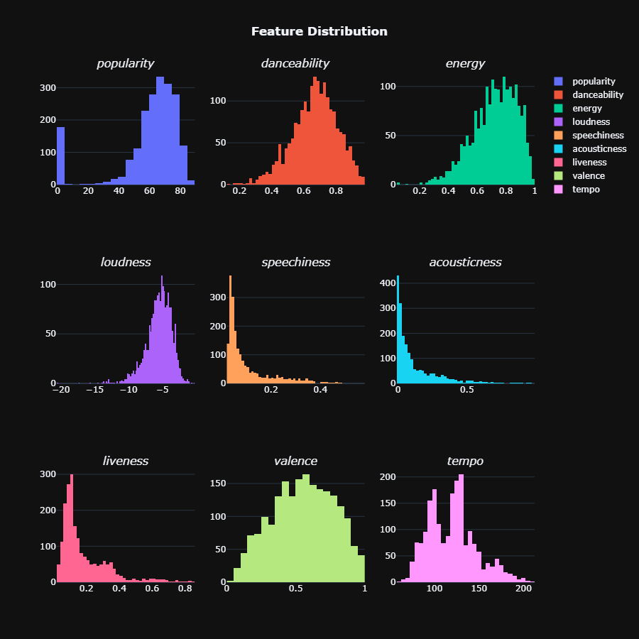
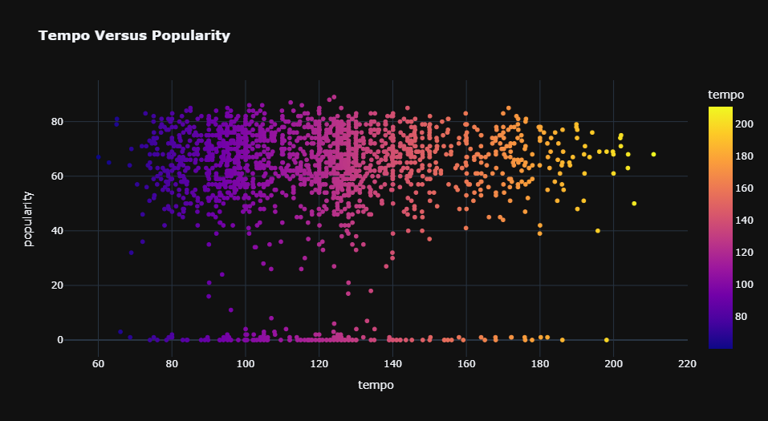
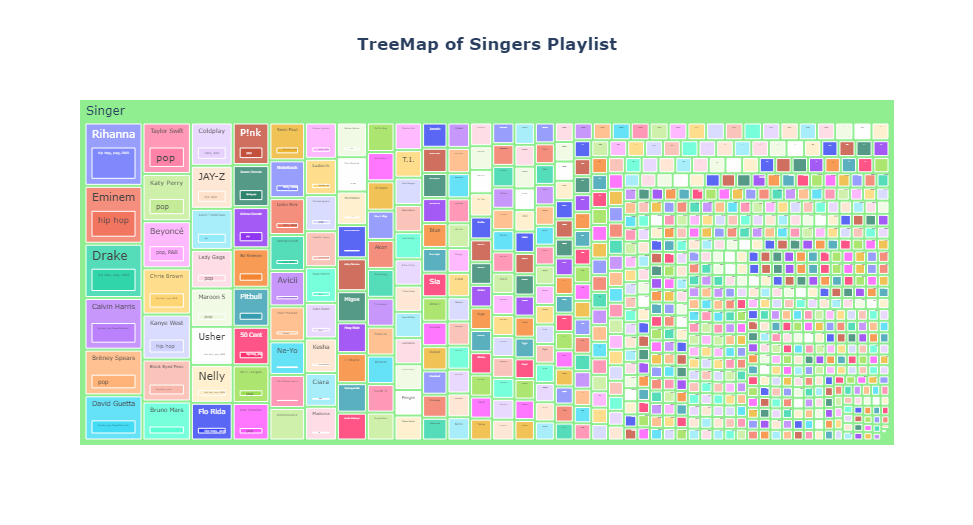
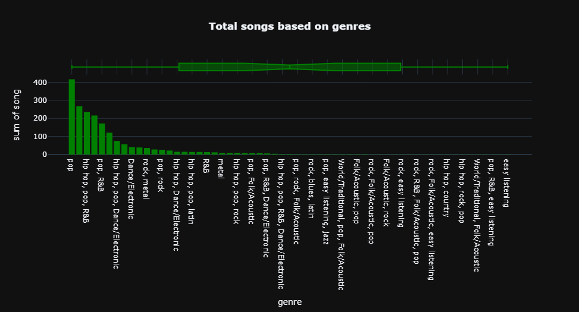

# Spotify Data Analysis

This project analyzes a dataset related to songs and playlists on Spotify to gain insights into factors that contribute to a song's popularity.

Dataset
The dataset used for this analysis is available on Kaggle here. The dataset contains information about over 600,000 songs on Spotify, including audio features, such as danceability, energy, and loudness, as well as popularity scores and playlist data.

Technologies Used
Python 3
Jupyter Notebook
Pandas
Numpy
Matplotlib
Seaborn
Analysis Methods
Correlation analysis
Statistical analysis
Data cleaning and preprocessing
Graphical analysis and visualization
Findings
Through the analysis of the Spotify dataset, we were able to identify several factors that contribute to a song's popularity, including danceability, energy, and valence. We also found that songs with higher acousticness and instrumentalness tend to be less popular.

Snapshots:

  
  
  
  
  

Conclusion
This project demonstrates the use of data analysis techniques and Python libraries to gain insights into music trends and preferences. The findings can be used by music producers and artists to create more popular songs, as well as by playlist curators to create more engaging and relevant playlists.
